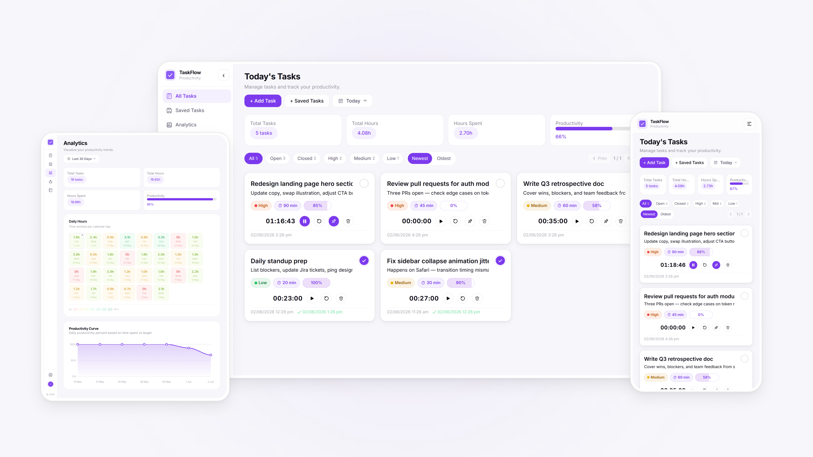

# TaskFlow

A browser based task manager built for personal productivity. It combines task tracking, per task timers, productivity analytics, and data export without requiring an account or backend.

Live: https://taskflow.pritamsardar.dev  |  Case Study: https://www.pritamsardar.dev/full-case-study/project-row-taskflow?source=case-studies

<picture>
  <source media="(prefers-color-scheme: dark)" srcset=".github/images/taskflow-hero-dark.png">
  
</picture>

## Features

* Create tasks with names, notes, priorities, and target times
* Start, pause, and reset timers for individual tasks
* Track progress against time goals
* Pin important tasks to keep them visible
* Filter and sort tasks by status, priority, and date
* Save reusable task templates and import them anytime
* View productivity analytics across custom date ranges
* Export task data as CSV or JSON
* Store everything locally with no account required

## Tech Stack

**Frontend:** React 19, Vite, Tailwind CSS v4

**State Management:** React Hooks, localStorage

**Utilities:** clsx, tailwind-merge

**Deployment:** Vercel

## Getting Started

### Prerequisites

* Node.js 18 or higher

### Clone and install

```bash
git clone https://github.com/pritamsardar-dev/portfolio-task-manager-v1.git

cd portfolio-task-manager-v1

npm install
```

### Run locally

```bash
npm run dev
```

App runs at `http://localhost:5173`.

No environment variables are required. All data is stored in the browser.

## Project Structure

```text
src/
├── components/
│   ├── app-shell/      # Application shell and sidebar layout
│   ├── dashboard/      # Dashboard UI and analytics views
│   ├── layout/         # Header, filters, pagination, and date controls
│   ├── task/           # Task cards, timers, progress tracking, and modals
│   ├── templates/      # Saved task template management
│   ├── export/         # Export screens and preview tables
│   └── ui/             # Shared UI components and notifications
│
├── features/
│   ├── dashboard/      # Analytics calculations and dashboard logic
│   └── tasks/          # Task filtering, sorting, and storage logic
│
├── hooks/              # Custom React hooks
├── pages/              # Route level application pages
└── utils/              # Shared helper functions
```

## Technical Notes

### Reliable Timer Persistence

Browser timers often lose accuracy when a tab becomes inactive, the page is refreshed, or the device goes to sleep.

Instead of relying on interval counts, TaskFlow stores timestamps and calculates elapsed time from the current clock whenever the timer updates. This keeps timers accurate even after long periods of inactivity.

### Daily Analytics Tracking

A task can run across multiple days, which makes analytics more difficult than simply storing a total duration.

To solve this, the application maintains a separate daily time store in localStorage. Each timer update only records the newly elapsed time for the current day, allowing the analytics dashboard to display accurate daily productivity data.

## Future Ideas

- Cloud sync across devices
- Team workspaces and shared task boards
- Recurring tasks and scheduled templates
- Progressive Web App support

## License

Licensed under the MIT License. See [LICENSE](./LICENSE) for details.

## Author

**Pritam Sardar**

GitHub: [github.com/pritamsardar-dev](https://github.com/pritamsardar-dev)

LinkedIn: [linkedin.com/in/pritam-sardar-dev](https://www.linkedin.com/in/pritam-sardar-dev/)

Portfolio: [pritamsardar.dev](https://pritamsardar.dev)

Email: [pritamsardar.dev@gmail.com](mailto:pritamsardar.dev@gmail.com)
